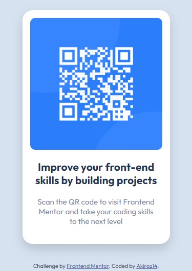

# Frontend Mentor - QR code component solution

This is my solution to the [QR code component challenge](https://www.frontendmentor.io/challenges/qr-code-component-iux_sIO_H) on [Frontend Mentor](https://www.frontendmentor.io/). Frontend Mentor challenges help you improve your coding skills by building realistic projects. 

## Table of contents

- [Overview](#overview)
  - [The Challenge](#The-Challenge)
  - [Screenshot](#screenshot)
  - [Links](#links)
- [My process](#my-process)
  - [Built with](#built-with)
  - [What I learned](#what-i-learned)
  - [Continued development](#continued-development)
- [Useful resources](#useful-resources)
- [Author](#author)
- [Acknowledgments](#acknowledgments)
  - [Useful project](#useful-project)


## Overview

### The Challenge

The challenge is to build out this QR code component and get it looking as close to the design as possible.

### Screenshot

This was my result (Mobile Desing)



### Links

- Solution URL: [Frontend Mentor](https://www.frontendmentor.io/solutions/qr-code-component-flexbox-bem-iTLvsQOljy)
- Live Site URL: [GitHub Page](https://akiraz14.github.io/qr-code-component/)

## My process

### Built with

- Semantic HTML5 markup
- CSS custom properties
- Flexbox
- Responsive Desing

### What I learned

I learned how to import Google Fonts directly into the CSS file. It was also a great opportunity to practice HTML, CSS, OOCSS and BEM and use CSS variables.

BEM code I liked:

```html
<section class="card card--small">
```
```css
.card--small {
    max-width: 18rem;
}
```

### Continued development

I will improve my knowledge in HTML, CSS, OOCSS and BEM. In future projects, I'd like to practice the mobile-first concept more and use media queries, pseudo-classes, and pseudo-elements in CSS.

## Useful resources

- [W3Schools](https://www.w3schools.com/) - I love this website!!! I highly recommend it.
- [Box Shadow Generator](https://box-shadow.dev/)
- [CSS Generator](https://cssgenerator.org/)

## Author

- Website - [Akiraz14](https://akiraz14.github.io/)
- Frontend Mentor - [@Akiraz14](https://www.frontendmentor.io/profile/Akiraz14)

## Acknowledgments

I looked at many projects, to see how others respond to this challenge, I want to highlight one project that helped me to support my solution proposal in terms of HTML and CSS code, especially in the use of BEM (Block, Element, and Modifier).

### Useful project

- Frontend Mentor - [@MelvinAguilar](https://www.frontendmentor.io/profile/MelvinAguilar) - [QR code component solution](https://github.com/MelvinAguilar/qr-code-component) - This helped me for the BEM structure. I really liked this pattern.

**Note: I didn't replicate this solution, I just wanted to make sure my understanding of BEM was clear, because I learned it recently and this was my first time using it.**
